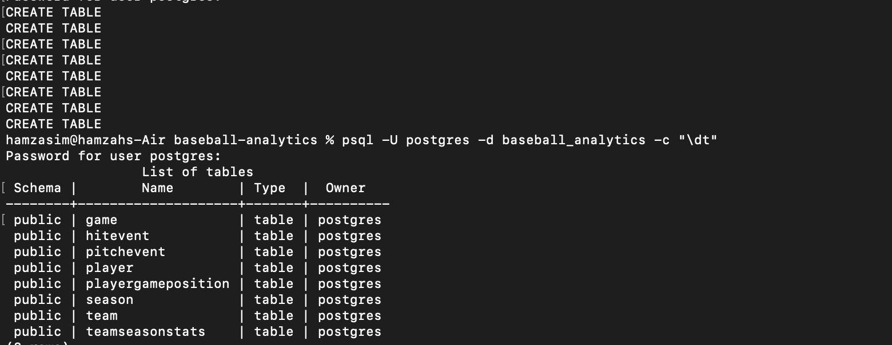

# ⚾ Baseball Analytics

A full-stack baseball analytics web app powered by real MLB Statcast data.
Built with PostgreSQL, Python, FastAPI, and React.

## What it does

**Stats Section** — Browse all 30 MLB teams across seasons from 2015 to present.
View season summaries including wins, losses, ERA, OPS, run differential, 
and playoff results. Drill into any season to see individual game results.

**Visuals Section** — Select any MLB player and season to see an interactive
home run spray chart — every home run plotted on a field diagram with exit
velocity, launch angle, and distance on hover. Pitchers get a pitch location
heatmap showing where they located every pitch.

## Tech Stack

| Layer    | Technology          |
|----------|---------------------|
| Database | PostgreSQL          |
| ETL      | Python, pybaseball  |
| Backend  | Python, FastAPI     |
| Frontend | React, Chart.js     |

## Database Design

Designed using ER modelling and normalized to 3NF.
7 entities covering teams, seasons, games, players,
and Statcast hit and pitch level events.

See full ERD in `/docs/erd.png`

## Project Status

- [x] Phase 1 — Database design and ER modelling
- [x] Phase 2 — Schema implementation and data ingestion
- [ ] Phase 3 — Backend API
- [ ] Phase 4 — Frontend

## Data Source

MLB Statcast data via [pybaseball](https://github.com/jldbc/pybaseball).
Covers 2015 to present, aligned with Statcast tracking system availability.

### Phase 2 — Schema Implementation
Tables created in PostgreSQL:

## Setup

*Coming soon as each phase is completed.*

## Author

Hamzah Asim
Computer Science, York University  
[LinkedIn](https://www.linkedin.com/in/hamzah-asim/) 