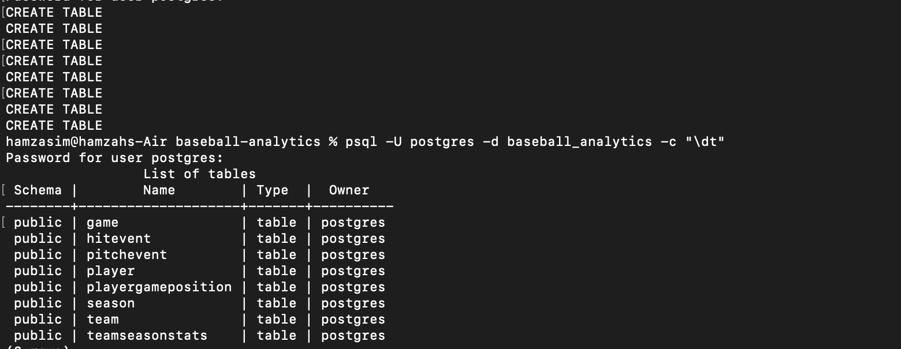

# ⚾ Baseball Analytics

A full-stack baseball analytics web app powered by real MLB Statcast data (2015–present).
Built with PostgreSQL, Python, FastAPI, and React.

## Live Demo
*Coming soon*

## What it does

**Stats Section** — Browse all 30 MLB teams across seasons from 2015 to present.
View season summaries including wins, losses, run differential, ERA, and OPS.
Drill into any season to see individual game results.

**Visuals Section** — Select any MLB player and season to see interactive visualizations:
- **Batters** — Home run spray chart with exit velocity, launch angle, and distance on hover
- **Pitchers** — Pitch location heatmap colored by pitch type with velocity and result on hover

## Tech Stack

| Layer    | Technology                        |
|----------|-----------------------------------|
| Database | PostgreSQL 18                     |
| ETL      | Python, pybaseball, pandas        |
| Backend  | Python, FastAPI, psycopg2         |
| Frontend | React, HTML5 Canvas, Axios        |

## Database Design

Designed using ER modelling and normalized to 3NF.
7 entities covering teams, seasons, games, players,
and Statcast hit and pitch level events.


## Database Scale

| Table | Rows |
|-------|------|
| Teams | 30 |
| Seasons | 12 |
| Players | 7,349 |
| Games | 27,450 |
| Hit Events | 1,274,660 |
| Pitch Events | 7,900,000+ |


## API Endpoints

| Method | Endpoint | Description |
|--------|----------|-------------|
| GET | `/teams` | All 30 MLB teams |
| GET | `/teams/{id}/seasons` | All seasons for a team |
| GET | `/teams/{id}/seasons/{year}` | Season stats for a team |
| GET | `/games/{team_id}/{year}` | All games for a team in a season |
| GET | `/players/search?name=` | Search players by name |
| GET | `/players/{id}/homeruns` | Home run data for spray chart |
| GET | `/players/{id}/games` | Games a batter appeared in |
| GET | `/pitchers/{id}/heatmap` | Pitch location data for heatmap |
| GET | `/pitchers/{id}/games` | Games a pitcher appeared in |

## Project Progress

- [x] Phase 1 — Database design and ER modelling
- [x] Phase 2 — Schema implementation in PostgreSQL
- [x] Phase 3 — ETL pipeline and data ingestion
- [x] Phase 4 — FastAPI backend with 9 endpoints
- [x] Phase 5 — React frontend with stats and visuals pages

## Screenshots

### Phase 2 — Schema Implementation


## Data Source

MLB Statcast data via [pybaseball](https://github.com/jldbc/pybaseball).
Covers 2015 to present, aligned with MLB Statcast tracking system availability.

## Setup

### Prerequisites
- PostgreSQL 18
- Python 3.11+
- Node.js 18+

### Database
```bash
createdb baseball_analytics
psql -U postgres -d baseball_analytics -f database/schema/schema.sql
python3 data/ingest.py
```

### Backend
```bash
pip3 install fastapi uvicorn psycopg2-binary pandas pybaseball python-dotenv
uvicorn backend.main:app --reload
```

### Frontend
```bash
cd frontend
npm install
npm start
```

### Environment Variables
Create a `.env` file in the project root:
DB_HOST=localhost
DB_NAME=baseball_analytics
DB_USER=postgres
DB_PASSWORD=your_password

## Design Decisions

See `DECISIONS.md` for documented technical decisions made throughout the project.

## Author

Hamzah Asim
Computer Science, York University
[GitHub](https://github.com/hamzasim-git/baseball-analytics)
[LinkedIn](https://www.linkedin.com/in/hamzah-asim/) 